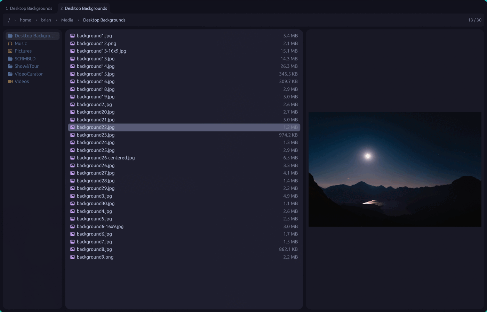
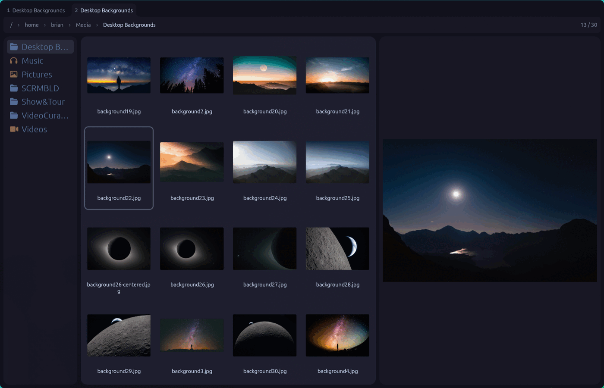

# delightfile

A keyboard-first file manager for Wayland, written in Rust and drawn on the GPU.

It started as a replacement for [yazi](https://github.com/sxyazi/yazi) and keeps yazi's
keymap almost key for key, so the muscle memory carries over. What it adds is everything a
terminal cannot do: real drag-and-drop into other applications, decoded video and audio in
the preview pane with shuttle controls, undo for every destructive operation, and a mouse
that behaves like one.



`=` steps up a ladder of four densities. At the top, the same directory is a thumbnail grid.
Each tab keeps its own step as it moves between folders, and a new tab starts at
`[mgr] view_scale`.



## Status

Every phase of [PLAN.md](PLAN.md) is built. About 129,000 lines of Rust and 1,531 tests,
clippy-clean. The workspace warns on `unsafe_code`, so each of the sixty-odd uses is opted
in by hand and sits next to a comment saying why: libc calls for inotify, `statfs`,
`copy_file_range` and thread priority, the Wayland data-device client, and FFmpeg's FFI in
the vendored `dv-media`.

It is my daily file manager on Hyprland with an NVIDIA card. It has not been tested on
other compositors, other GPUs, or X11. Bugs from those are expected rather than
surprising.

## What is in it

Three miller columns, a preview pane that decodes rather than shells out, and a top bar
that carries the breadcrumbs, the position counter, the git branch, and whatever prompt is
open.

- **Previews that decode.** Images including AVIF and HEIF, video with a scrub strip and
  the `j`/`k`/`l` shuttle ladder, audio with a waveform, PDF pages, font specimen sheets,
  3D models on a turntable, G-code layers, syntax-highlighted text, rendered markdown, and
  archive contents. Animated GIF, WebP, APNG and AVIF play in place.
- **Drag and drop.** Drag rows out to Chrome's upload box or to an editor over
  `text/uri-list`. Drop files in from anywhere. Drag between panes, tabs and windows, with
  a stacked-card ghost and a count badge.
- **Undo.** Every move, copy, rename, trash and link goes through a journal, and `u` walks
  it back.
- **Git awareness.** Status dots per row, dimmed hidden files, branch and dirty count in
  the top bar.
- **Disk usage.** A background `du` streams folder sizes into the size column and settles
  them as it goes. No ncdu round trip.
- **Archives as directories.** Walk into zip, tar, tar.gz, tar.xz and tar.zst, preview
  what is inside, extract the selection. 7z, rar and bzip2 are detected and refused rather
  than half-read.
- **Trash and mounts.** The freedesktop trash browsed as a directory with restore on
  `Enter`, udisks2 mount/unmount over a hand-rolled D-Bus client, and gvfs network
  shares (SMB, SFTP, FTP, WebDAV, NFS) listed beside the disks, with a connect prompt.
- **SFTP.** Hosts from yazi's `vfs.toml` browse as directories, with download-on-open and
  upload-on-drop.
- **Tabs.** Folder tabs joined to the bar below them, reorderable by dragging, and
  detachable into their own window.

It shares a thumbnail cache with yazi and with
[delightviewer](https://github.com/brianschwabauer/delightviewer), so all three hand off
the exact frame you were looking at.

## Building

Needs a Wayland session, a recent stable Rust, and FFmpeg 9 development libraries, which
`ffmpeg-next` links against. On Arch that is `pacman -S rust ffmpeg`.

```sh
cargo build --release
```

The binary lands at `target/release/delightfile`. `bash build/install.sh` copies it to
`~/.local/bin` along with the desktop entry, the icons, and the file-picker wrapper, then
prints the two commands that make it the system default.

PDF previews want `libpdfium.so`, loaded at runtime from `~/.local/lib/delightfile/`,
`~/.local/lib/delightviewer/`, or the system loader. Grab a build from
[bblanchon/pdfium-binaries](https://github.com/bblanchon/pdfium-binaries) (ABI
`pdfium_7881`). Without it a PDF falls back to its thumbnail, which is a missing feature
and never an error.

`fd`, `rg`, `git`, `zip`, `bsdtar` and `wl-copy` are run as subprocesses when they exist.
Each one only powers its own feature, and a missing binary shows up as a message naming it
rather than as a failure. The trash, the D-Bus mount client, the TOML parser and the
clipboard are all implemented here rather than shelled out to.

## Making it the desktop's file manager

```sh
xdg-mime default delightfile.desktop inode/directory
```

That covers `xdg-open`, "open containing folder", and every launcher that asks the desktop
database who handles a directory.

## Making it the file picker

Every GTK and Qt file dialog on a Wayland desktop can be routed through
[xdg-desktop-portal-termfilechooser](https://github.com/hunkyburrito/xdg-desktop-portal-termfilechooser),
which hands a wrapper script an output path and runs a file manager against it. Chrome's
upload box, its "Save as", and every "Attach a file" in every web app then open delightfile
instead of GTK's dialog.

`build/delightfile-wrapper.sh` is that wrapper. Install it (or run `build/install.sh`,
which does), then write two files:

```ini
# ~/.config/xdg-desktop-portal-termfilechooser/config
[filechooser]
cmd=delightfile-wrapper.sh
default_dir=$HOME
open_mode=suggested
save_mode=suggested
```

```ini
# ~/.config/xdg-desktop-portal/portals.conf
[preferred]
org.freedesktop.impl.portal.FileChooser=termfilechooser
```

Then `systemctl --user restart xdg-desktop-portal`.

In a picker session `Enter` picks the selection and quits, a directory still opens on
`Enter`, and `q` cancels. The mechanism underneath is one flag:

```sh
delightfile --chooser-file=/tmp/picked ~/Downloads
```

Whatever was picked is written to that file, one absolute path per line. Nothing is written
if you quit any other way, which is how the portal is told the dialog was dismissed.

## Keys

Arrow keys navigate. `hjkl` does not, and that is the one deliberate break from yazi:
`j`, `k` and `l` are the video transport, globally, so you can arrow onto a video and play
it without leaving the list.

| | |
|---|---|
| `↑` `↓` `←` `→` | move, leave, enter |
| `g g` `G` | top, bottom |
| `Ctrl+u` `Ctrl+d` | half page |
| `Alt+←` `Alt+→` | history back, forward |
| `Ctrl+l` | type a path to go to |
| `Enter` `o` | open. `O` picks the opener |
| `Space` `v` `Ctrl+a` | select, visual mode, all |
| `y` `x` `p` `P` | yank, cut, paste, paste over |
| `Y` `c t` | copy the file to the clipboard, copy its text |
| `d` `D` | trash, delete for good |
| `a` `r` `R` | create, rename, rename the stem |
| `u` | undo |
| `f` `/` `n` `N` | filter, find, next, previous |
| `s` `S` | search names (`fd`), search contents (`rg`) |
| `z` `Z` | fuzzy jump, zoxide jump |
| `t` `1`–`9` `Alt+[` `Alt+]` | new tab, switch, previous, next |
| `Tab` | the spot panel: metadata, EXIF, checksum |
| `-` `=` | walk this tab's density ladder: Compact, Comfortable, Roomy, Grid |
| `j` `k` `l` | video shuttle, anywhere |
| `Ctrl+←` `Ctrl+→` | frame step or page turn in the preview |
| `M` `w` `g t` | mounts, tasks, trash |
| `Ctrl+p` | command palette |
| `F10` | app menu, also the `≡` button at the left of the path |
| `?` | help |
| `q` `Q` | quit. `Q` skips the cwd-file |

Hold a prefix key and a which-key card lists what follows it.

## Configuration

`~/.config/delightfile/delightfile.toml`, `keymap.toml` and `theme.toml`. All three are
optional. The defaults are a port of my yazi config, so they carry its opener rules (with
delightfile's own edits), the same `[1, 4, 3]` column ratio, catppuccin-mocha, and the
nineteen custom directory icons.

SFTP hosts come from `~/.config/yazi/vfs.toml` first and
`~/.config/delightfile/vfs.toml` second, so an existing yazi setup needs no second copy.

`--cwd-file=<path>` writes the directory you ended in when you quit with `q`, which is what
lets a shell function follow you:

```sh
df() {
  tmp=$(mktemp)
  delightfile --cwd-file="$tmp" "$@"
  cd "$(cat "$tmp")" || return
  rm -f "$tmp"
}
```

## Architecture

Five crates:

- `df-core` is headless. The filesystem model, sorting and filtering, the operation journal
  and undo, the keymap engine, config parsing, the task engine, previews, git, archives,
  `du`, zoxide, and the SFTP vfs. It never touches winit, egui or wgpu, so `cargo test`
  exercises it on a machine with no display.
- `df-app` is the binary. One winit `ApplicationHandler`, every pixel painted onto an
  `egui::Painter`, and the parts that need a compositor: drag-and-drop, the clipboard,
  D-Bus.
- `dv-core`, `dv-media` and `dv-playback` come from delightvideo by way of delightviewer,
  vendored unchanged so this repository builds on its own.

Two decisions shape the rest. The event loop repaints on events and never polls, so an
idle window costs zero frames and `DF_FRAME_LOG=1` names whatever woke it. And motion is
pure functions over `(inputs, Instant)` with tests, so no animation was eyeballed.

There are no widgets. Everything is drawn straight onto a painter, which is why the hover,
ripple and press behaviour is consistent across rows, chips, tabs and menus: there is one
implementation of each.

## Non-goals

No Lua or plugin scripting. No embedded terminal. No light theme yet. X11 only if it falls
out of winit for free.

## License

GPL-3.0-or-later. See [LICENSE](LICENSE).

The vendored `dv-*` crates arrived under that license and stay under it. Separately, any
binary built here links FFmpeg, and a distribution's FFmpeg is usually compiled
`--enable-gpl`, so the compiled result has to be redistributed under the GPL regardless of
what this repository says.
